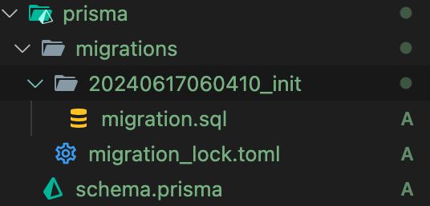

2024/06/17

prisma는 ORM이다.

ORM이란 Object-Relational Mapping의 약자로 그 의미를 풀어보면 객체와 관계( 관계형 데이터베이스 )를 맵핑하는 것으로 해석될 수 있다.

왜 객체와 DB를 매핑하는지 알아보면, 보통 DB를 관리하기 위해서는 SQL 쿼리를 직접 작성하여 조회, 삽입등을 해야 합니다.

```SQL
/* SQL문을 쓰는 예시 */

INSERT INTO users (name, age) VALUES ('Alice', 25)
```

```js
// prisma를 쓰는 예시

prisma.use.create({ data: { name: "Alice", age: 25 } });
```

ORM을 쓰면 개발자는 굳이 SQL 쿼리문을 알지 못하더라도 DB를 조회, 관리할 수 있습니다.
ORM을 쓰는 이유는 다양하지만 이에관해서는 별도로 다시 정리해보겠습니다.

## prisma와 mysql 연동하기

### 1. install

```shell
npm install prisma --save-dev
npm install @prisma/client
```

### 2. initialization

```shell
npx prisma init
```

초기화를 하면 prisma 폴더와 schema.prisma 파일이 생성됩니다.
ex)

1. db와 연결할 때의 설정
2. Prisma generator를 실행 시킬 때의 설정
3. 모델 정의 ( 해당 모델을 바탕으로 DB와 매핑됩니다. )

```prisma
// 데이터베이스 연결 설정
datasource db {
  provider = "mysql"
  url      = env("DATABASE_URL")
}

// Prisma 클라이언트 생성기 설정
generator client {
  provider = "prisma-client-js"
}

// 모델 정의
model User {
  id    Int    @id @default(autoincrement())  // 자동 증가하는 기본 키
  name  String                              // 사용자 이름
  email String @unique                      // 고유한 이메일 주소
  age   Int                                 // 사용자 나이
  posts Post[]                              // 일대다 관계: 사용자 -> 포스트
}

model Post {
  id        Int      @id @default(autoincrement())  // 자동 증가하는 기본 키
  title     String                                 // 포스트 제목
  content   String?                                // 포스트 내용 (선택적)
  published Boolean  @default(false)               // 발행 여부
  author    User     @relation(fields: [authorId], references: [id])  // 다대일 관계: 포스트 -> 사용자
  authorId  Int                                    // 작성자 ID (외래 키)
}
```

### 3. 마이그레이션 실행

```shell
npx prisma migrate dev --name init
```

dev : 개발과정에서 실행하는 마이그레이션
--name init : 초기 마이그레이션을 의미하는 init 이름을 붙여서 마이그레이션

해당 명령어를 통해 migrations 폴더에 생성한 날짜와 함께 마이그레이션 폴더가 생성되고 내부에 마이그레이션 sql파일이 생성됩니다.



migration으로 만들어진 sql을 바탕으로 DB가 생성됩니다.

```sql
-- prisma/migrations/20240617060410_init/migration.sql
-- CreateTable
CREATE TABLE `User` (
    `user_id` INTEGER NOT NULL AUTO_INCREMENT,
    `username` VARCHAR(191) NOT NULL,
    `password` VARCHAR(191) NOT NULL,
    `email` VARCHAR(191) NOT NULL,
    `created_at` DATETIME(3) NOT NULL DEFAULT CURRENT_TIMESTAMP(3),

    PRIMARY KEY (`user_id`)
) DEFAULT CHARACTER SET utf8mb4 COLLATE utf8mb4_unicode_ci;

--- ...
```

### 4. prisma generator 실행

```shell
npx prisma generate
```

마이그레이션과 동일하게 schema.prisma을 바탕으로 우리가 사용할 prisma client를 생성합니다.
그렇게 생성된 client는 node_modules/@prisma/client에 위치합니다.
그리고 import를 통해 사용할 수 있습니다.

client를 통해 위에서 소개한 sql 쿼리문 없이 객체를 통해 조회, 생성 등 DB 상호작용 작업이 가능합니다.

```js
import { PrismaClient } from "@prisma/client";

const prisma = new PrismaClient();

// 데이터 생성
prisma.category.create({
  data: {
    category_name: newCategory,
  },
});

// 데이터 조회
prisma.category.findMany();
```

이렇게 간편하게 prisma client 객체를 통해 DB와 상호작용 할 수 있습니다.
