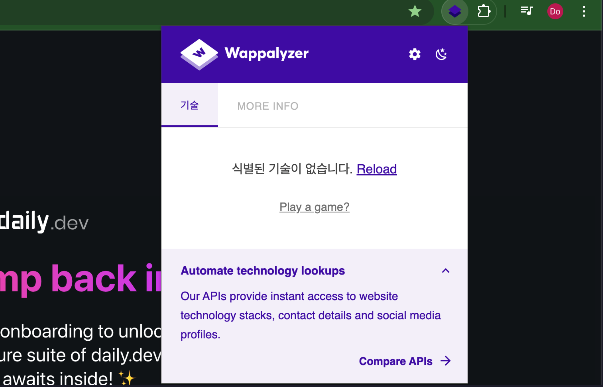
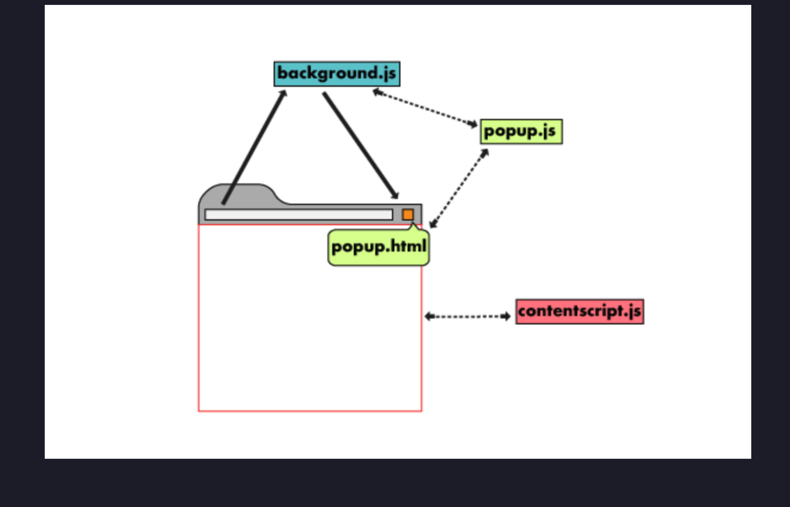
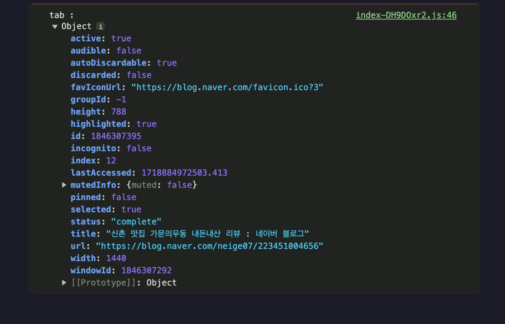

# 크롬 extension 개발기

## 중요 개념

### manifest

확장프로그램의 메타데이터와 동작에 관한 정보를 나타내는 파일입니다. 확장프로그램을 개발하기 위한 필수 요소로
크롬 브라우저가 확장프로그램을 올바르게 로드,실행할 수 있게 도와줍니다. ( json 파일형식으로 저장됨 )

- 기본적인 형태

```json
{
	"manifest_version": 3, // 확장프로그램이 사용하는 버전은 3으로 고정
	"name": "Minimal Manifest",
	"version": "1.0.0",
	"description": "A basic example extension with only required keys",
	"icons": {
		"48": "images/icon-48.png",
		"128": "images/icon-128.png"
	}

	// 선택적인 key
	- action
	- background
	- permissions
	- host_permissions
	- ...
}
```

### popup

extension 이 보여지는 작은 화면
최대 800 x 600 사이즈의 크기를 가질 수 있습니다.



### service worker

확장프로그램의 중앙 이벤트 핸들러, background 영역에서 실행됨.
웹 서비스워커와 공통적인 부분이 존재하고 새페이지로 이동, 알림클릭, 탭 닫기등 확장프로그램의 이벤트에도 응답합니다.

### content script

확장 프로그램과 웹페이지 간의 상호작용을 위한 스크립트
웹페이지의 JS 파일 과는 다른 독립적인 환경에서 실행 되며 서로의 변수를 공유하지 않습니다. ( 충돌 방지 )

- 흐름 도식화



- 기본적인 설정

```json
{
  "manifest_version": 3,
  "name": "My Extension",
  "version": "1.0",
  "description": "An example extension.",
  "permissions": ["activeTab"],
  "background": {
    "service_worker": "background.js"
  },
  "content_scripts": [
    {
      "matches": ["<all_urls>"], // 모든 URL에서 동작
      "js": ["content.js"] // 실행하려는 JS 스크립트
    }
  ]
}
```

확장 프로그램 예시

## 구현하고자 하는 부분

- 북마크 정보를 관리하기 위하여 현재 tab의 url 정보를 가지고 와야한다.

popup 부분과 현재 활성화되어있는 tab은 별개의 영역이기 때문에
extension 구현 부분에서 location.herf를 찍어본들 아무런 정보가 나오지 않는다.

그래서 우리는 Chorme 브라우저와 소통할 수 있는 것이 필요하다.

- chrome.tabs
  `chrome.tabs` API를 사용하여 브라우저의 탭 시스템과 상호작용합니다. 이 API를 사용하여 브라우저에서 탭을 만들고 수정하고 재정렬할 수 있습니다.  
   Tabs API는 탭을 조작하고 관리하는 기능을 제공할 뿐만 아니라 탭의 [언어](https://developer.chrome.com/docs/extensions/reference/api/tabs?hl=ko#method-detectLanguage)를 감지하고, [스크린샷](https://developer.chrome.com/docs/extensions/reference/api/tabs?hl=ko#method-captureVisibleTab)을 찍고, 탭의 콘텐츠 스크립트와 [커뮤니케이션](https://developer.chrome.com/docs/extensions/reference/api/tabs?hl=ko#method-sendMessage)할 수도 있습니다.

현재 탭 정보 가져오기

```js
async function getCurrentTab() {
  let queryOptions = { active: true, lastFocusedWindow: true };

  // `tab` will either be a `tabs.Tab` instance or `undefined`.
  let [tab] = await chrome.tabs.query(queryOptions);

  return tab;
}
```

- 탭의 정보



- 코드 정리

```ts
export const getUrl = async (): Promise<string> => {
  const queryInfo = { active: true, currentWindow: true };

  return new Promise((resolve, reject) => {
    if (!chrome.tabs) resolve(location.href);

    chrome.tabs.query(queryInfo, (tabs) => {
      if (chrome.runtime.lastError) {
        return reject(new Error(chrome.runtime.lastError.message));
      }

      if (tabs.length === 0) {
        return reject(new Error("No active tab found"));
      }

      const tab = tabs[0];
      const url = tab.url;
      if (url) {
        resolve(url);
      } else {
        reject(new Error("No URL found for the active tab"));
      }
    });
  });
};
```

## 이슈 사항

저렇게 구현하려면 manifest에 permission에 tab에 대한 권한 요구를 해야함\_ [링크](https://chrome.google.com/webstore/devconsole/4a090272-b9eb-4791-b7ab-14cf63a51169/peelnaadoapokjneichiehbfkpgcfpmk/edit/privacy)

그러면 심사 받을 때 저 권한이 왜 필요한지 사유를 작성해햐함. 사유를 까다롭게 작성하지 않는다면 괜찮지만
까다롭다면 content script에서 정보를 메세지로 보내고 backgroun js 에서 데이터를 저장하고 잇다가
popup js 에서 데이터를 요청하면 message로 다시 보내는 방법...

```js
// background.js
let currentUrl = "";

chrome.runtime.onMessage.addListener((message, sender, sendResponse) => {
  if (message.action === "currentUrl") {
    currentUrl = message.url;
  }
});

chrome.runtime.onMessage.addListener((message, sender, sendResponse) => {
  if (message.action === "getUrl") {
    sendResponse({ url: currentUrl });
  }
});
```

```js
// content.js
chrome.runtime.sendMessage({ action: "currentUrl", url: window.location.href });
```

```js
// popup.js
const getUrl = async () => {
  return new Promise((resolve, reject) => {
    chrome.runtime.sendMessage({ action: "getUrl" }, (response) => {
      if (response.url) {
        resolve(response.url);
      } else {
        reject(new Error("No URL found"));
      }
    });
  });
};
```

가능은 하지만, 뭔가 억지로 구현한 느낌.
추후 인증 정보를 storage에 저장할 예정 이에 대한 권한도 요구해야하기 때문에
권한 요구를 하고 사유를 작성해보는게 좋아 보임
