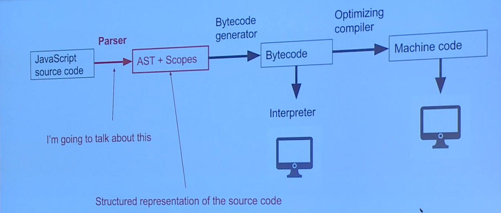
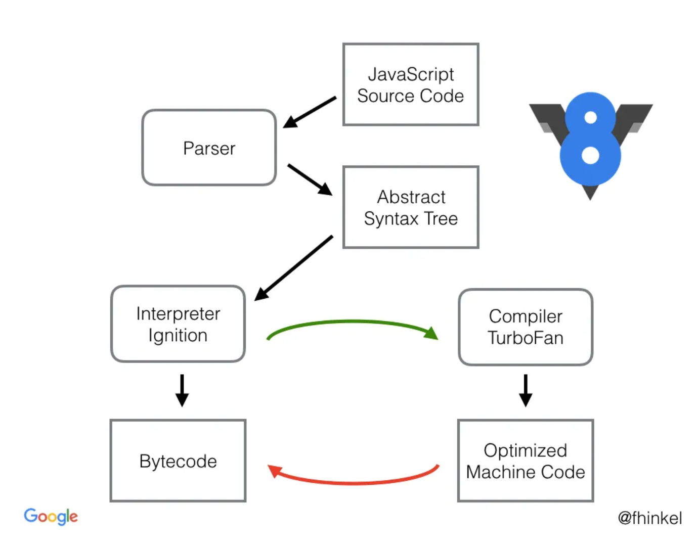
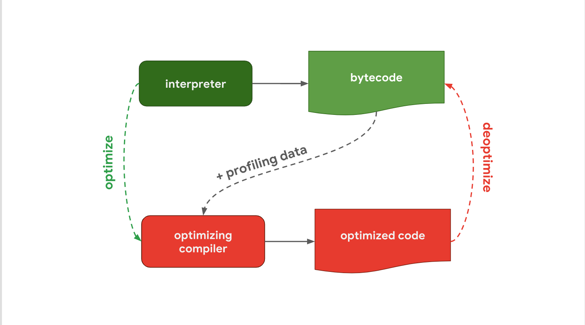
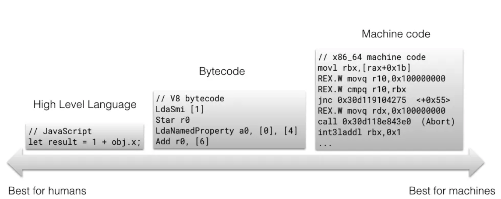

# V8 engine

V8은 C++로 작성된 google의 오픈 소스 고성은 Javascript, WebAssembly 엔진이다.
Chrome과 Node.js에서 사용된다.

## 기본적인 동작 원리

1. 자바스크립트 코드 소스를 `Parser`에게 전달한다.
2. `Parser`는 자바스크립트 소스코드를 분석하여 `AST`와 `Scope`를 생성한다.
3. Interpreter인 `Ignition`은 `AST`을 기반으로 `Byte Code`를 생성한다. ( 한 줄씩 실행 )
4. Interpreter인 `Ignition`은 생성한 `Byte Code`을 실행한다. ( 한 줄씩 실행 )  
   4.1. 만약 실행 과정 중에 반복적으로 실행되는 동일한 코드에 대해서는 정보를 수집한다.  
   4.2. 반복적으로 실행되는 코드를 `hotspot`으로 간주하고 `Turbo Fan`에 전달한다.  
   4.3. `Turbo Fan`은 전달받은 코드를 최적화 기법을 통해 속도를 개선합니다.  
   4.4. 만약 최적화된 코드에서 예기치 않은 예외상황이 발생한다면, 최적화되기 전 `Byte Code`로 되돌려서 실행한다.



## 세부 동작 프로세스

### Parser

> 2. `Parser`는 자바스크립트 소스코드를 분석하여 `AST`와 `Scope`를 생성한다.

`AST`는 소스코드의 문법적인 구조를 나타낸 것이다.

아래의 자바스크립트 코드를 `Parser`를 통해 분석하면

```js
function fn() {
  let a = 0;
  if (a === 0) {
    let b = "foo";
    return a;
  }
}
```

다음과 같이 컴퓨터가 이해하기 쉬운 구조로 변환된다.

- FunctionLiteral
- VariableDeclaration
  - VariableProxy
- Assignment
  - VariableProxy
  - Literal
- IfStatement
  - (condition) BinaryOperation
  - (then) Block
    - VariableDeclaration
      - VariableProxy
    - Assignment
      - VariableProxy
      - Literal

소스 코드를 이렇게 잘짜여진 구조로 만드는 것은 상당한 리소스가 소요되는 작업니다.
그래서 V8은 해당과정을 `Pre-Parser`, `Parser` 두가지 파싱 모드로 나누어서 수행한다.

- `Parser` : full, 'eager'

  - 컴파일하고자 하는 모든 함수의 구문분석에 사용됨
  - `AST`를 만든다.
  - `Scope`를 만든다.
  - 모든 구문 에러를 찾는다.

- `Pre-Parser` : fast, 'lazy'
  - 컴파일 하지 않을 함수들을 건너뛰는데에 사용됨. (실행시키지 않는 함수)
  - `AST`를 만들지 않는다.
  - `Scope`를 만든다. 하지만 변수 참조 또는 그들의 선언들 넣지 않는다.
  - `Parser`보다 2배 빠르다.
  - JS의 사양과 일치하지 않는 몇몇의 에러만 찾는다.

```js
let a = 0; // 최상단 코드는 Paser로 Parsing

(function eager(){...})() // 즉시 실행 함수는 Paser로 Parsing

function lazy(){...} // 즉시 실행 함수가 아닌 최상단 함수는 Pre Parser로 Parsing

lazy() // 추후 실행 된다면 Paser로 Parsing
```

### Ignition / Trubo Fan



`AST`를 기반으로 `Ignition`는 최적화되지 않은 `Byte Code`를 빠르게 생성한다.  
`Byte Code`는 기계어 즉, 머신코드를 추상화한 코드라고 할 수 있다.
위 그림에서 보이는 `compiler Turbo Fan`은 최적화 compiler라고 불린다.  
최적화 compiler는 바로 `byte code`를 만드는 것보다는 오래 걸리지만 고도로 최적화된 머신코드를 생성한다.

인터프리터 / 컴파일러 파이프라인을 분리해서 좀더 상세히 살펴보면 다음과 같은 흐름을 가진다.



Ignition는 byte code를 생성하고 실행하는 역활을 하는데 byte code를 실행하면서 추가적으로 profiling data를 수집한다.

실행하는 함수가 hot 해질 때, 즉 자주 실행된다고 판단될 때  
해당 byte code와 수집된 profiling data를 compiler turbofan에 전달한다.

그리고 compiler turbofan은 해당 코드를 최적화된 머신코드로 변환한다.

_해당과정은 자바스크립트 엔진별도 디테일한 과정을 다를 수 있지만, 아키텍쳐 부분에서 살펴 보면 파서 -> 인터프리터 / 컴파일러 파이프라인을 가진다._

> 그렇다면 왜 이렇게 분리시켜 놓았을까?

앞서 설명한 것 처럼 최적화 compiler는 바로 `byte code`를 만드는 것보다는 오래 걸리지만 고도로 최적화된 머신코드를 생성한다.를 풀어서 설명하면

일반적으로 `Ignition`는 빠르게 byte code를 생성한다. 하지만 byte code는 그다지 호율적인 code는 아니다. 하지만 실행하는데는 문제가 없다.  
반면에 최적화 compiler는 시간은 상대적으로 오래걸리지만 호율적인 머신코드를 생성한다. 또한 추가적으로 메모리의 사용량도 byte code보다 많이 차지한다.

결론은

> 비효울적이지만 빠르게 생성할 수 있는 `Ignition` vs 효율적이지만 생성하는 속도와 크기가 큰 머신코드를 생성하는 `Turbo Fan` 둘 사이의 trade off를 고려하여 여러 계층으로 분리하여 실행하는 것.  
> _분리하지않으면 한가지 방법으로 코드를 관리해야해서 한쪽의 단점이 너무 과부화 되기 때문_



그리고 TurboFan은 어떤 코드가 더이상 최적화하기에 적합하지 않다고 판단되면 최적화를 진행하지 않고 이전 byte code로 돌아가서 해당 코드를 실행합니다 이를 de-optimizing이라고 한다.

> _최적화하기에 적합하지 않다고 판단되는 기준 중 하나는 js는 동적 타입 언어이기 때문에 어느순간 최적화된 코드에서 적용한 타입이 아닌 다른 타입의 데이터가 들어오면 기 최적화된 머신코드에서 동작하지 않는다._
