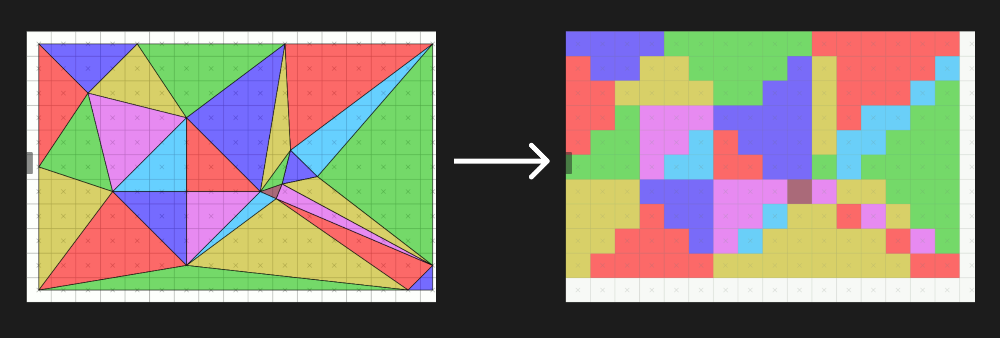
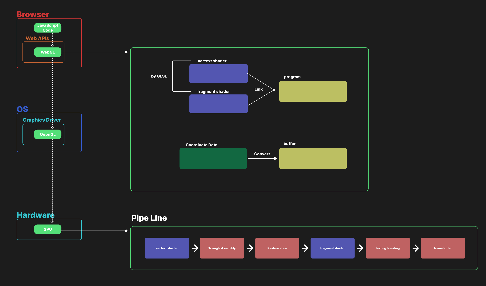
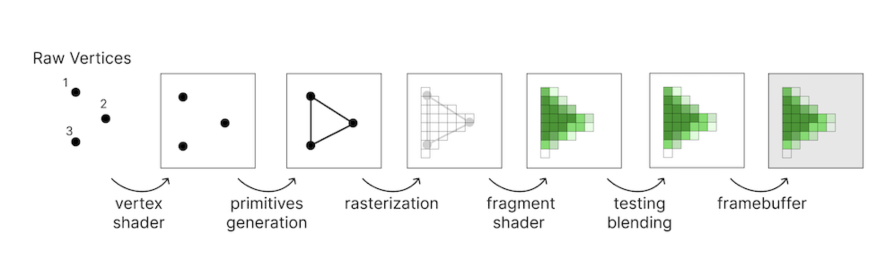

# what is WebGL

WebGL은 Web Graphics Library로 플러그인을 사용하지 않고 웹 브라우저에서 상호작용 가능한 3D와 2D 그래필을 표현하기 위한 JS API이다.

WebGL은 랜더링되어야할 데이터와 그 데이터를 가공하기 위한 함수들을 GPU에 전달하는 역할을 한다.

# WebGL이 나오기 전에는 3D와 2D 그래픽을 어떻게 표현하였는가

1. 플러그인
   이전의 그래픽 렌더링은 보통 플러그인을 활용하여 구현되었다.

- Adobe Flash
- Microsoft Silverlight
- Java Applets

2. HTML + CSS
   또는 간단한 애니메이션은 HTML와 CSS로 구현할 수 있었으나 복잡한 그래픽을 구현하는데는 한계가 있었다.

3. SVG

4. `<canvas>`'s 2D Context

# detail WebGL

WebGL은 OpenGL(ES 2.0)을 기반으로 만들어진 Web API이다.  
HTML의 canvas element에서 WebGL context 생성하여 렌더링을 수행합니다.

canvas 자체로도 간단한 2D 그래픽 작업은 가능하지만, 복잡한 3D 그래픽을 렌더링 작업을 위해서는 WebGL을 활용하여 렌더링 작업을 수행하는 것이 효율적입니다.

WebGL을 사용하여 그래픽을 렌더링하는 전체적인 흐름은 다음과 같습니다.

1. canvas 생성
2. WebGL context(환경) 생성
3. shader 생성
4. buffer 설정
5. 변환 및 조명 처리
6. 레스터화 및 출력

# what is shader

shader는 화면에 출력에 필요한 정점(Vertex)의 위치와 픽셀의 색상을 계산 작업을 수행한다.

shader는 GLSL(OpenGL Shading Language)이라는 프로그래밍언어로 작성된다.

### vertex shader

- 정점의 위치를 계산하는 shader

ex)

```glsl
attribute vec3 aPosition; // 입력: 정점 좌표
uniform mat4 uModelViewMatrix; // 모델-뷰 변환 행렬
uniform mat4 uProjectionMatrix; // 투영 변환 행렬

void main() {
    // 정점의 위치를 변환하고, gl_Position에 전달
    gl_Position = uProjectionMatrix * uModelViewMatrix * vec4(aPosition, 1.0);
}
```

### fragment shader

- 각 픽셀의 색상을 계산하는 shader

ex)

```glsl
precision mediump float; // 프래그먼트 셰이더의 정밀도
uniform vec4 uColor; // 입력: 색상

void main() {
    // 픽셀의 최종 색상 설정
    gl_FragColor = uColor;
}

```

이러한 Vertax shader와 fragment shader를 하나로 묶어 (shader)프로그램으로 GPU에 전달됩니다.

# what is buffer

buffer는 렌더링되어야할 그래픽 데이터를 의미합니다.  
일반적으로 buffer는 위치, 법선, 텍스쳐 좌표, 정점 색상등 다양한 정보를 포함합니다.

# what is 레스터화(rasterization)

우리가 브라우저에 보여지는 선과 면은 그렇게 보여질뿐 실질적으로는 모니터의 픽셀들이 이어진 것입니다.  
 그래서 모든 선과 면들은 그려지기 위해서 픽셀화처리를 해주어야 컴퓨터는 그것들을 그려나갈 수 있습니다.  


# 전체적인 흐름도



## GPU Pipe-line


