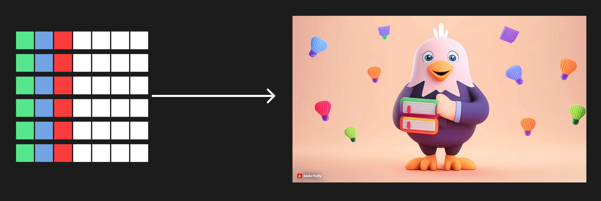

# 브라우저에서 이미지를 처리하는 과정

## 1. 이미지 데이터 로드

HTML 문서의 파싱: 웹 브라우저는 HTML 문서를 파싱(parsing)하여 문서 구조를 이해합니다. 이 과정에서  태그가 발견되면 브라우저는 해당 이미지의 src 속성에 명시된 URL을 통해 이미지를 로드할 준비를 합니다.


이미지 파일 요청: 브라우저는 이미지 파일을 가져오기 위해 HTTP(S) 요청을 서버에 보냅니다. 서버는 이미지 파일(예: PNG, JPEG, GIF 등)을 브라우저에 전송합니다.


이미지 데이터 수신: 브라우저는 서버로부터 이미지 파일 데이터를 수신하고 이를 메모리에 저장합니다. 이 데이터는 바이너리 포맷으로 저장됩니다.


## 2. 이미지 데이터 디코딩

파일 형식 확인: 이미지 데이터가 메모리에 저장되면, 브라우저는 파일의 형식을 확인합니다. 일반적으로 파일의 헤더(파일의 첫 번째 몇 바이트)를 검사하여 형식을 결정합니다. 대표적인 이미지 형식으로는 JPEG, PNG, GIF, SVG 등이 있습니다.

이미지 디코딩: 이미지 파일은 보통 압축된 형식으로 저장됩니다(예: JPEG의 경우 손실 압축, PNG의 경우 무손실 압축). 브라우저는 이 압축된 이미지를 디코딩하여 픽셀 데이터를 복원합니다. 이 과정에서 이미지의 각 픽셀에 대한 색상 정보(RGB 또는 RGBA 값)가 생성됩니다.

### [example]

#### binary data

```text
89 50 4E 47 0D 0A 1A 0A 00 00 00 0D 49 48 44 52 -> 보통 header, 첫번째 몇 바이트가 이 데이터가 어떠한 파일 형식인지를 나타냄
00 00 00 64 00 00 00 64 08 06 00 00 00 70 E2 95
54 00 00 00 09 70 48 59 73 00 00 0B 13 00 00 0B
13 01 00 9A 9C 18 00 00 00 07 74 49 4D 45 07 E6
08 0C 12 33 13 93 8E 3C C9 00 00 00 19 74 45 58
74 53 6F 66 74 77 61 72 65 00 41 64 6F 62 65 20
49 6D 61 67 65 52 65 61 64 79 71 C9 65 3C 00 00
00 20 63 48 52 4D 00 00 7A 26 00 00 80 84 00 00
FA 00 00 00 80 E8 00 00 75 30 00 00 EA 60 00 00
3A 98 00 00 17 70 9C BA 51 3C 00 00 01 B4 49 44
41 54 78 DA EC 9A 3B 0E 83 30 0C 44 47 FF F1 3B
64 2F 04 86 7E 59 4B 23 50 30 B8 5F 6E C2 2B 7D
DF BD 02 16 78 C6 2D 63 22 E2 21 16 D8 F6 4A 24
95 72 D7 7A 45 DA 0A C9 6B 88 77 4B E8 52 59 10
B2 34 91 44 24 11 26 89 A9 44 8C 44 92 46 7C 10
21 84 F8 31 63 C7 16 00 00 00 00 49 45 4E 44 AE
42 60 82
```

#### decoding to pixel data

```
[
    [(255, 0, 0, 255), (0, 255, 0, 255)],  # 첫 번째 행: 빨강(Red)과 초록(Green)
    [(0, 0, 255, 255), (255, 255, 0, 255)] # 두 번째 행: 파랑(Blue)과 노랑(Yellow)
]
```

## 3. 이미지 랜더링

DOM 및 CSSOM 통합: 브라우저는 파싱된 HTML로 DOM(Document Object Model)을 구성하고, CSS 파일을 파싱하여 CSSOM(CSS Object Model)을 구성합니다. 이미지의 위치, 크기 및 스타일은 이 단계에서 결정됩니다.

레이아웃 계산: 브라우저는 DOM과 CSSOM을 통합하여 렌더 트리를 구성합니다. 렌더 트리는 화면에 실제로 그려질 요소들만 포함하며, 각 요소의 위치와 크기를 계산합니다. 이 과정에서 이미지가 어느 위치에 얼마나 큰 크기로 그려질지 결정됩니다.

이미지 드로잉: 브라우저는 디코딩된 픽셀 데이터를 사용하여 이미지를 화면에 그립니다. 이 과정에서 GPU(그래픽 처리 장치)가 활용되기도 합니다. 이미지의 픽셀 데이터는 프레임 버퍼에 저장되고, GPU가 이를 디스플레이 장치에 전송하여 화면에 이미지를 표시합니다.



