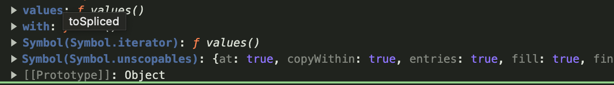

# iteration protocol

## for-of

> ### for-of는 왜 나왔는가?

자바스크립트에서 object를 순회하는 방법은 for-in도 있는데 왜 ES6에서 for-of가 추가되었는가

`for-in`은 객체의 key를 이용하여 object를 순회한다.

```js
const obj = {
  key1: "value1",
  key2: "value2",
};

for (key in obj) {
  console.log(obj[key]);
}

// value1
// value2
```

그렇다면 `for-in`을 사용하여 배열을 순회하면 어떻게 동작할까?  
순회는 가능하지만, object와 달리 key로 할 수 있는 index가 문자열로 반환되고
원본 Array에 새로 추가된 prototype 속성도 함께 나온다는 점 때문에 굳이 for...in으로 순회하는 것을 추천하지 않습니다.

```js
Array.prototype.foo = "hello";
const forInArr = [1, 2, 3, 4, 5, 6, 7];

for (let i in forInArr) {
  console.log(i);
}

// 0 1 2 3 4 5 6 hello
// prototype에 추가된 속성도 함께 나온다.
```

그래서 ECMA2015 추가된 문법이 for...of 이다.  
for...of는 열거가능한 모든 객체가 순회가능합니다.

> 열거가능한(enumerable) 객체
> array
> 문자열 ( string )
> Map
> Set
> DOM collection

### So, 그렇다면 for...of는 어떻게 열거가능한 모든 객체를 순회할 수 있는 것 일까

결론을 말하면 앞서 말한 열거가능한 모든 객체들은 내부적으로 Iterable Protocol을 구현하고 있기 때문이다.

> ## what is iterable protocol?
>
> 정의 : 데이터 컬렉션을 순회하기 위한 프로토콜( 약속된 규칙 )  
> 조건 : next() 함수를 구현해야하고, 그 반환값은 { value: someValue, done: Boolean } 을 반환해야한다.
> 해당 조건을 지키면 다음과 같다.

```js
function makeIterator(start = 0, end = Infinity, step = 1) {
  let nextIdx = start;
  let n = 0;

  let Iterator = {
    // n ext 함수
    next: function () {
      let result;
      if (nextIdx < end) {
        result = { value: nextIdx, done: false };
      } else if (nextIdx == end) {
        result = { value: n, done: true };
      } else {
        result = { done: true };
        nextIdx += step;
        n++;
        // {value: someValue, done:Boolean} 반환
        return result;
      }
    },
  };

  return Iterator;
}

const iteratorIstance = makeIterator(1, 4); // Iterator 객체 반환
// 1~4 까지 순회할 수 있는 객체

let result = iteratorIstance.next();
while (!result.done) {
  console.log(result.value);
  result = iteratorIstance.next();
  // closure로 내부 변수를 증가시키면서 4까지 순회
}
```

이러한 메소드들이 객체의 원본에 [Symbol.iterator] 로 정의되어있다.  
ex) Array  


for...of는 [Symbol.iterator]를 반복하면서 실행합니다.

```js
const iterable = {
  [Symbol.iterator]() {
    return {
      i: 0,
      next() {
        if (this.i < 3) {
          return { value: this.i++, done: false };
        }
        return { value: undefined, done: true };
      },
    };
  },
};

for (var value of iterable) {
  // 반복적으로 [Symbol.iterator]를 실행하여 내부 정보와 next()를 반환 받는다.
  console.log(value); // 0 1 2
}
```

그렇기 때문에 어느한 객체든지 iterable protocol이 정의되어있다면 for...of를 통해 순회할 수 있다는 말이다.
