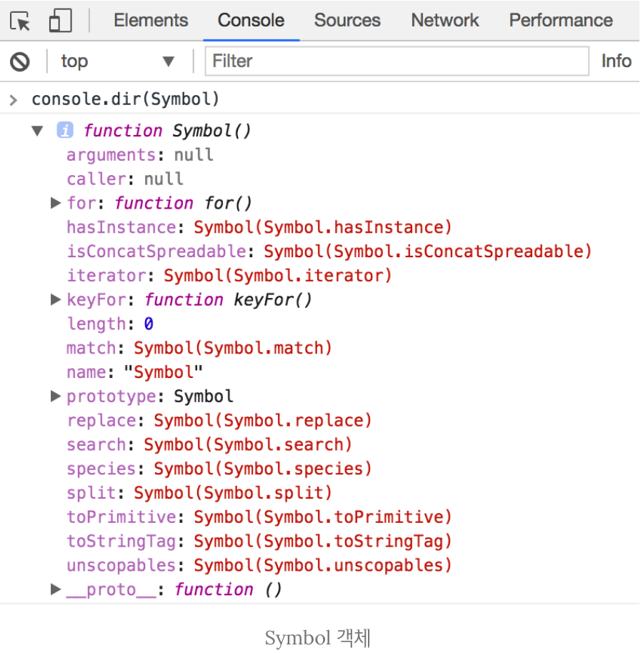

# Symbol Type

ES6에서 새롭게 추가된 7번재 타입  
변경 불가능한(재생산 될 수 없는) 원시 타입의 값

> 왜 추가 되었을까?

일단, 원시값은 변경할 수 없습니다. 원시값이 할당된 변수를 재할당하는 것이 가능하다.

```js
let x = 1;
x++;

// x -> 2
// x를 재할당한 것이지 원시값 1을 변경한 것은 아니다.
```

> 참조에 의한 전달, 값에 의한 전달
> C언어에는 이러한 개념이 있지만,  
> JS에는 데이터 유형(원시 타입 - [값에 의한 전달], 참조 타입 - [참조에 의한 전달])에 따라 달라진다
>
> - 값을 함수에 전달한다.
> - 그 값을 재할당
> - 그러면, 호출 위치의 값이 변경되지 않는다.
> - 하지만, 비원시값을 수정하면 호출 위치에서도 수정된 값이 반영된다.

무슨 소리지??

```js
// 값을 재할당하는 함수
function primitiveMutator(val) {
  val = val + 1;
}

let x = 1;
// 값을 전달
primitiveMutator(x);

// 외부에서 변수 호출
// x -> 1 호출 위치에 따라 값이 변경 안됨.
console.log(x);

// 객체의 값을 변경하는 함수
function objectMutator(val) {
  val.prop = val.prop + 1;
}

let obj = {
  prop: 1,
};

objectMutator(obj);

// 객체는 호출된 위치에 따라 변경된 값이 반영
// obj.prop -> 2
console.log(obj.prop);
```

음... 원시타입은 변경  
요건 그림을 그리면서 이해해보자

객체는 키/값 쌍의 컬렉션으로 자주 사용된다.  
이러한 방식으로 객체를 사용하면 한계점이 있다.  
symbol 타입이 있기 전까지는 객체의 키는 문자열만 가능하다.  
임의로 문자열이 아닌 값을 키로 설정하면 자동으로 문자열으로 변환한다.

Ex)

```js
const obj = {};
obj.foo = "foo";
obj["bar"] = "bar";
obj[2] = 2;
obj[{}] = "someobj";

console.log(obj);

/*
 * { '2':2, foo: 'foo', bar: 'bar', '[object Object]': 'someobj'}
 *
 * /
```

### so, 이러한 JS의 데이터 형식에서 symbol은 무엇인가?

객체 + 원시를 합친느낌

- 여러 인스터스를 생성해도 같이 않은 값이 생성 ( 객체 )
- 변형될 수 없다. ( 원시 )

```js
const s1 = symbol();
const s2 = symbol();

console.log(s1 === s2); // false
// 객체의 특성

// const obj1 = {key1: 'value'}
// const obj2 = {key1: 'value'}

// console.log(obj1 === obj2)  false
```

symbol은 옵셔널로 문자열 인자를 전달할 수 있는데,  
이는 디버깅을 위해 사용된다. symbol 생성 자체에는 영향을 미치지 않습니다.

> 객체 속성으로서 symbol  
> ex)
>
> ```js
> const obj = {};
> const sym = Symbol();
> obj[sym] = "foo";
> obj.bar = "bar";
> console.log(obj); // {bar : 'bar'}
> console.log(sym in obj); // true -> 있는지는 확인 가능 하지만 기본적인 접근으로는 확인 안됨
> console.log(obj[sym]); // foo
> console.log(Object.keys(obj)); // ['bar'] // sym 확인 안됨.
> // Object.keys() 로는 접근 불가능 이전코드( ES5 코드 )가 인식하지 못하기 때문
> ```

약간 그런 느낌 객체에 비공개 키/값을 추가하는 느낌( JS 이외의 언어에서는 기본적으로 있는 기능 )  
but.다른 메소드를 통해 접근 가능 ( 완전한 비공개는 아닌 )

`Reflect.ownKeys()`

```js
function tryToAddPrivate(obj) {
  obj[Symbol("private")] = 10;
}

const originObj = { prop: "hello" };
tryToAddPrivate(originObj);
console.log(Reflect.ownKeys(originObj)); // ['prop', Symbol(private)]
```

### ! 내가 생각할 때 Symbol을 쓰는 주요 이유

**속성 이름 충돌 방지**

여러 라이브러리가 객체의 속성을 추가할 때 이름 충돌의 위험 없이 사용할 수 있다.

만약 두개의 다른 라이브러리가 객체에 메타 데이터를 추가하려고 한다.

```js
function setMetaLibrary1(obj) {
  obj.id = 12;
}

function setMetaLibrary2(obj) {
  obj.id = 172;
}

// 동일하게 'id' 라는 키값으로 메타데이터를 설정하려고 함. -> 충돌 발생 상당히 높음
```

만약 symbol을 사용한다면??

```js
const library1Symbol = Symbol("lib1");

function setMetaLibrary1(obj) {
  obj[library1Symbol] = 12;
}

const library2Symbol = Symbol("lib2");

function setMetaLibrary2(obj) {
  obj[library2Symbol] = 172;
}
```

충돌하지 않음.  
하지만 그럼 키 값만 다르게 설정하면 되지 않냐..  
랜덤으로 key값을 생성하거나, 각 라이브러리에 따라 생성하는 네임페이스 형식의 키값을 생성하면 되겠다.

- 네임스페이스 방식

```js
const library1property = uuid(); // 랜덤 생성
function lib1tag(obj) {
  obj[library1property] = 42;
}

const library2property = "LIB2-NAMESPACE-id"; // 네임스페이스 접근 방식
function lib2tag(obj) {
  obj[library2property] = 369;
}
```

이렇게 쉽게 동일한 key 값을 설정 할 수 없게 할 수 있다.
쉽게 고유한 key값을 설정할 수 있지만, 단점으로 해당 키를 찾기 쉽다는 점이 있다.  
Object.keys()로 찾거나 객체를 직렬화해서 찾을 수 있다.

```js
const library2property = "LIB2-NAMESPACE-id"; // 네임스페이스
function lib2tag(obj) {
  obj[library2property] = 369;
}
const user = {
  name: "Thomas Hunter II",
  age: 32,
};
lib2tag(user);
console.log(JSON.stringify(user));
// '{"name":"Thomas Hunter II","age":32,"LIB2-NAMESPACE-id":369}'
```

하지만 이 점도 보완할 수 있는 방법이 있다.
`Object.defineProperty`를 이용하여 숨길 수 있습니다.

```js
const library2property = uuid(); // 네임스페이스 접근 방식
function lib2tag(obj) {
  Object.defineProperty(obj, library2property, {
    enumerable: false, // 숨김 처리
    value: 369,
  });
}
const user = {
  name: "Thomas Hunter II",
  age: 32,
};
lib2tag(user);
console.log(JSON.stringify(user));
// '{"name":"Thomas Hunter II","age":32}'
console.log(user[library2property]); // 369
```

그렇기 때문에 랜덤값, 네임스페이스로 키값을 생성하는 것과 symbol로 생성하는 것을 비슷하게 쓸 수 있다.  
하지만 차이점이 분명히 존재한다. 랜덤값, 네임스페이스는 동일한 값을 찾이 어려울뿐이지 아예 충동하지 않을 가능성이 없다는것은 아니다.  
반면에 symbol을 항상 고유하다는 보장을 할 수 있다.

## Symbol 객체

Symbol은 다음과 같은 프로퍼티와 메소드를 가지고 있다.
legth와 prototype을 제외한 프로터피를 `wel-known Symbol`이라고 한다.



`wel-known Symbol`는 자바스크립트 엔진에 상수로 존재하고 있다.  
 그래서 해당 값들을 참조하여 특정한 처리를 한다.  
 예를 들면 다음과 같다.

### [4.1 Symbol.iterator](../iteration/iteration.md)

어떠한 객체가 Symbol.iterator를 프로퍼티 key로 사용한 메서드가 있다면, 자바스크립트 엔진은  
해당 객체가 이터레이션 프로토콜을 따르는 것으로 간주한다. 그래서 순회가 가능하도록 동작한다.

기본적으로 다음과 같은 객체들이 기본적으로 Symbol.iterator 키로 메서드가 내장되어있다.

> Array
> Array.prototype[Symbol.iterator]
>
> String
> String.prototype[Symbol.iterator]
>
> Map
> Map.prototype[Symbol.iterator]
>
> Set
> Set.prototype[Symbol.iterator]
>
> DOM data structures
> NodeList.prototype[Symbol.iterator] HTMLCollection.prototype[Symbol.iterator]
>
> arguments
> arguments[Symbol.iterator]
