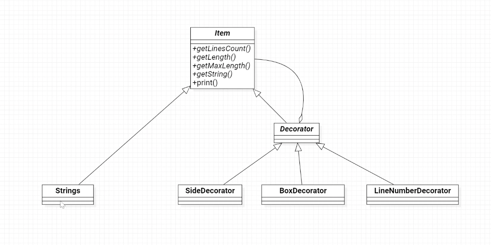
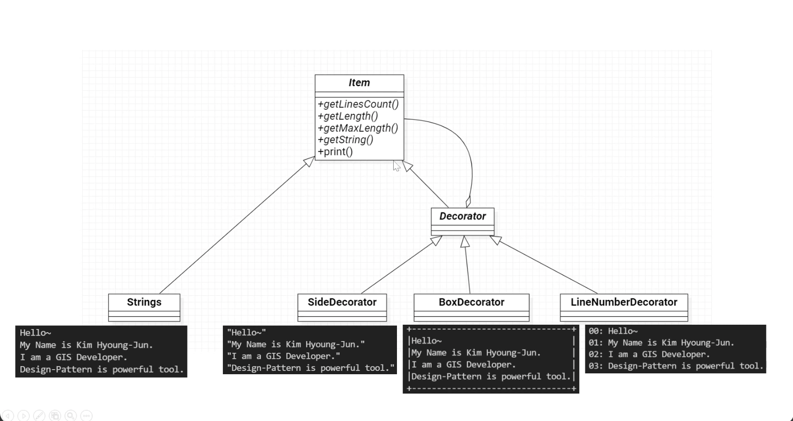
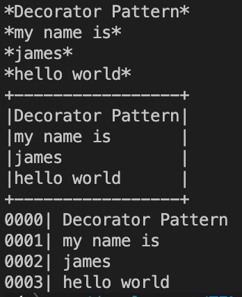

# Decorator Pattern

장식이 되는 대상과 장식을 동일한 개념으로 처리  
기능을 장식처럼 계속 추가할 수 있는 패턴  
기능을 실행 중에 _동적으로_ 변경 또는 확장할 수 있는 패턴

- 클래스 다이어그램 예시
  

### Strings Class

- 문자열 값을 배열을 통해 여러개 가지고 있음.
- 장식할 대상물

### Item Class

- Strings와 Decorator의 추상클래스
- Strings(장식의 대상)과 Decorator(장식)을 이어주는 매개체

### Decorator Class

- Strings class에 대한 장식을 나타내는 클래스

### SideDecorator Class

- Decorator Class를 상속
- 구체적인 장식품에 해당

### BoxDecorator Class

- Decorator Class를 상속
- 구체적인 장식품에 해당

### LineNumberDecorator Class

- Decorator Class를 상속
- 구체적인 장식품에 해당

